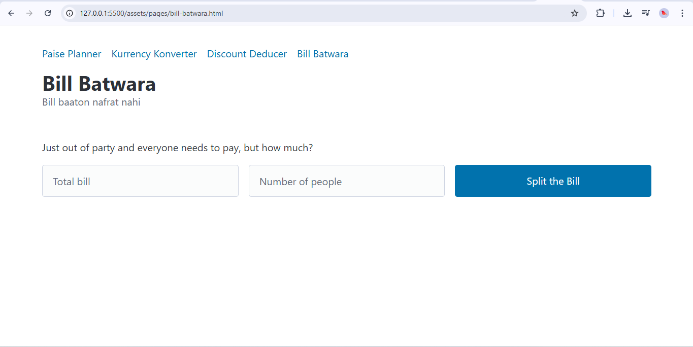

# FinKit 💸

**FinKit** is your all-in-one personal finance toolkit—a web app designed to help you manage, track, and optimize your finances effortlessly. Whether you're planning your savings, splitting bills, converting currencies, or calculating discounts, FinKit brings together four powerful mini-apps under one roof to make money management simple and accessible for everyone.

---

## 🚀 Live Demo

Try FinKit online: [https://finkit-v1.netlify.app/](https://finkit-v1.netlify.app/)

---

## 🧰 Toolkit Overview

FinKit is a collection of four intuitive mini-apps:

### 1. Paise Planner *(Finance Goal Tracker)*
- **Set financial goals**: Input your target savings, current savings, and desired time frame.
- **Monthly saving suggestion**: Calculates how much you need to save per month to reach your goal.
- 

### 2. Kurrency Konverter *(Currency Converter)*
- **USD to INR conversion**: Instantly converts US Dollars to Indian Rupees.
- **Easy to use**: Just enter the amount in USD, and get the INR equivalent.
- 

### 3. Discount Deducer *(Discount Calculator)*
- **Calculate discounts**: Enter the total amount and discount percentage to see the final price and total savings.
- **Shopping made smarter**: Know exactly how much you save on every purchase.
- 

### 4. Bill Batwara *(Bill Splitter)*
- **Split bills easily**: Enter the total bill and number of people—get how much everyone needs to pay.
- **Perfect for group outings**: No more confusion after parties or dinners.
- 

---

## 🌟 Features

- **Simple and Intuitive UI**: Clean, distraction-free design for seamless user experience.
- **Modular Structure**: Each tool is a mini-app—you can use only what you need.
- **Responsive Design**: Works smoothly on both desktop and mobile devices.
- **Instant Calculations**: All tools provide immediate results, making finance management quick and hassle-free.

---

## 🖥️ Tech Stack

- **HTML5 & CSS3**
- **JavaScript (Vanilla)**
- **[PicoCSS](https://picocss.com/)** for minimal styling
- **Modular file structure**: Each tool in `/assets/pages/`

---

## 📁 Project Structure

```plaintext
FinKit/
│
├── index.html                # Main dashboard (Paise Planner)
├── assets/
│   ├── css/
│   │   └── main.css
│   ├── img/
│   │   └── [Tool Images]
│   ├── pages/
│   │   ├── converter.html    # Kurrency Konverter
│   │   ├── discount-cal.html # Discount Deducer
│   │   └── bill-batwara.html # Bill Batwara
├── README.md                 # You are here!
```

---

## 📦 How to Use

1. **Clone the repo:**
   ```bash
   git clone https://github.com/shivankushsingh09/FinKit.git
   cd FinKit
   ```
2. **Open `index.html` in your browser.**
   - Navigate to other mini-apps using the navigation bar.
   - Use each tool as needed—no setup required!

---

## 🎯 Use Cases

- **Students**: Budget your monthly allowance.
- **Travelers**: Convert currencies on the go.
- **Shoppers**: Calculate savings during sales.
- **Groups**: Split restaurant or party bills easily.

---

## 🙌 Contribution

Contributions, suggestions, and feature requests are welcome!  
Feel free to fork the repo and open a pull request.

---

## 📄 License

This project is [MIT](LICENSE) licensed.

---

## 💬 Connect

- Created by [shivankushsingh09](https://github.com/shivankushsingh09)
- Inspired by [neog.camp](https://neog.camp)

---

**FinKit**—Your personal finance toolkit, from zero to hero! 🚀